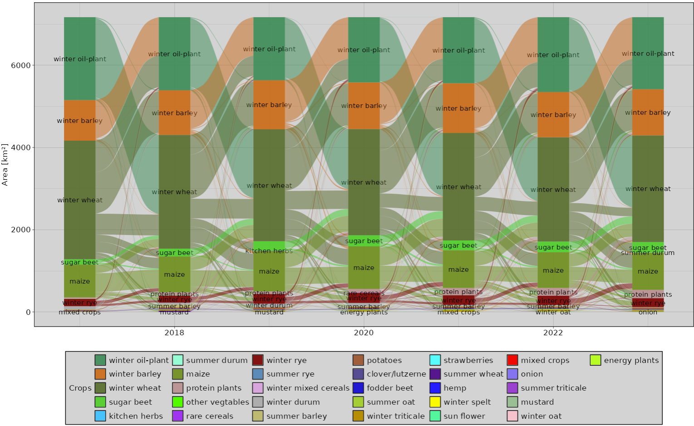

# CropRotationViz 🌾 :corn:

<div align="center">
  
</div>

An interactive web application for visualizing and analyzing crop rotation patterns across agricultural landscapes. Built with R Shiny, this tool helps agricultural stakeholders understand rotation patterns, assess risks, and make data-driven decisions for sustainable farming practices.


## Features

- **Interactive Rotation Visualization**
  - Dynamic Sankey diagrams showing crop sequences
  - Spatial distribution maps of rotation patterns
  - Temporal analysis of rotation changes (2017-2023)

- **Risk Assessment Tools**
  - Disease pressure analysis based on rotation patterns
  - Weed risk evaluation
  - Hotspot identification for management optimization

- **Diversity Analysis**
  - Structural and functional diversity metrics
  - Temporal diversity trends
  - Regional comparison tools

- **Data Export & Reporting**
  - Custom report generation
  - Data export in multiple formats
  - Summary statistics downloads

## Getting Started

### Prerequisites

- R (>= 4.1.0)
- RStudio (recommended for development)
- Required R packages:

```r
install.packages(c(
  "shiny",
  "shinydashboard",
  "leaflet",
  "dplyr",
  "ggplot2",
  "DT",
  "networkD3",
  "sf",
  "tidyr",
  "plotly"
))
```

### Installation

1. Clone the repository:
```bash
git clone https://github.com/yourusername/CropRotationViz.git
cd CropRotationViz
```

2. Install dependencies:
```r
source("install_dependencies.R")
```

3. Configure your environment:
```r
# Copy example configuration file
cp config.example.R config.R
# Edit config.R with your settings
```

### Running the Application

```r
shiny::runApp()
```

## Data Structure

The application expects input data in the following format:

```r
data_structure <- data.frame(
  field_id = character(),      # Unique identifier for each field
  year = numeric(),            # Year of observation (2017-2023)
  crop = character(),          # Crop type
  area_ha = numeric(),         # Field size in hectares
  geometry = sf::st_geometry() # Spatial data
)
```

## Usage Examples

### Basic Rotation Analysis
```r
# Load example data
data <- read_rotation_data("path/to/data")

# Generate rotation visualization
plot_rotation_sankey(data)
```

### Risk Assessment
```r
# Calculate disease risk based on rotation patterns
risk_analysis <- calculate_disease_risk(rotation_data)

# Visualize risk hotspots
plot_risk_map(risk_analysis)
```

## Interface Overview

The application is organized into several main sections:

1. **Dashboard**
   - Overview statistics
   - Key performance indicators
   - Quick navigation

2. **Rotation Analysis**
   - Temporal patterns
   - Spatial distribution
   - Sequence analysis

3. **Risk Assessment**
   - Disease pressure maps
   - Weed risk evaluation
   - Management recommendations

4. **Reports**
   - Custom report generation
   - Data export options
   - Summary statistics

## Contributing

Contributions are welcome! Please read our [Contributing Guidelines](CONTRIBUTING.md) for details on our code of conduct and the process for submitting pull requests.

### Development Setup

1. Fork the repository
2. Create your feature branch (`git checkout -b feature/AmazingFeature`)
3. Commit your changes (`git commit -m 'Add some AmazingFeature'`)
4. Push to the branch (`git push origin feature/AmazingFeature`)
5. Open a Pull Request

## License

This project is licensed under the MIT License - see the [LICENSE.md](LICENSE.md) file for details.

## Target Users

- Agricultural Policy Makers
- Researchers & Scientists
- Farm Advisors & Consultants
- Farmers & Farm Managers
- Agricultural Education Institutions
- Environmental Organizations

## Citation

If you use this tool in your research, please cite:

```bibtex
@software{croprotationviz2024,
  author = {Schulze, Franz and Pöhlitz, Julia and Conrad, Christopher},
  title = {CropRotationViz: Interactive Analysis of Agricultural Rotation Patterns},
  year = {2024},
  publisher = {GitHub},
  url = {https://github.com/franz-geoeco/CropRotationViz}
}
```

## Acknowledgments

- Ministry for Climate Protection, Agriculture, Rural Areas and Environment of MWP for providing IACS data
- R Shiny community for excellent documentation and support
- Contributors and beta testers

## Contact

- **Project Lead**: [Franz Schulze](franz.schulze@geo.uni-halle.de)
- **Project Website**: [https://croprotationviz.example.com](https://croprotationviz.example.com)

## Updates & Versions

See [CHANGELOG.md](CHANGELOG.md) for a list of changes and version updates.
