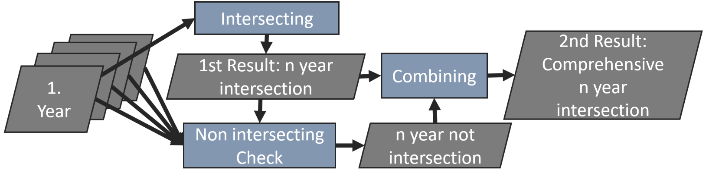

::: {align="right"}

:::

# CropRotationViz 🌾 :corn:

<!-- badges: start -->

[](https://github.com/franz-geoeco/CropRotationViz/actions/workflows/R-CMD-check.yaml) [](https://codecov.io/gh/franz-geoeco/CropRotationViz) [](https://opensource.org/licenses/MIT)

<!-- badges: end -->

## Overview {#overview}

CropRotationViz is a comprehensive R package that provides interactive Shiny applications for analyzing and visualizing crop rotation patterns from multi-year agricultural field data. The package integrates spatial data processing, statistical analysis, and dynamic visualization tools to help researchers and practitioners understand temporal patterns in agricultural land use.

### Why CropRotationViz is Particularly Helpful

Understanding crop rotation patterns is crucial for: - **Agricultural Research**: Analyzing crop diversification, temporal patterns, and land-use strategies across regions and time periods - **Environmental Sustainability**: Identifying rotation practices that may impact soil health, biodiversity, and ecosystem services - **Policy Making**: Evidence-based agricultural planning and monitoring compliance with crop rotation policies - **Farm Management**: Comparing rotation strategies across different regions or farming systems

**Key Advantages:** - **No Coding Required**: User-friendly Shiny interface makes complex spatial-temporal analysis accessible to non-programmers - **Handles Large-Scale Data**: Efficiently processes multi-year field-level data across extensive agricultural regions - **Flexible Data Input**: Supports both vector (shapefile, GeoJSON, etc.) and raster formats with custom crop classification systems - **Interactive Visualizations**: Sankey diagrams, interactive maps, and statistical summaries reveal rotation patterns that would be difficult to detect in raw data - **Spatial Context**: Unlike traditional databases, maintains and visualizes the spatial relationships between fields and their rotations - **Comparative Analysis**: Side-by-side visualization enables quick comparison across districts, catchments, or time periods

The package consists of three main components:

-   A processing application for preparing and intersecting field data with user customisable settings
-   A full visualization application for detailed analysis
-   A fast visualization application for quick insights and area comparison

::: {align="center"}

:::

## Table of Contents

-   [Overview](#overview)
-   [Features](#features)
    -   [Field Data Processing Tool](#field-data-processing-tool)
    -   [Visualization Tools](#visualization-tools)
    -   [Data Analysis](#data-analysis)
-   [Installation](#installation)
-   [Usage](#usage)
    -   [Basic Usage](#basic-usage)
    -   [Step-by-Step Guide](#step-by-step-guide)
        -   [Processing](#processing)
        -   [Visualization](#visualization)
-   [Data Requirements](#data-requirements)
    -   [Input Data Structure](#input-data-structure)
-   [Example Data](#example-data)
-   [Dependencies](#dependencies)
-   [Background](#background)
    -   [How it Works](#how-it-works)
    -   [Example](#example)
-   [Contributing](#contributing)
-   [License](#license)
-   [Citation](#citation)
-   [Contact](#contact)
-   [Acknowledgments](#acknowledgments)

## Features {#features}

-   **Field Data Processing Tool**
    -   Support for multiple spatial file formats (SHP, GeoJSON, FlatGeobuf, GeoPackage, SQLite)
    -   **Raster file support** (.tif, .tiff) with custom crop translation files
    -   **Batch upload feature** - Select and load multiple files at once (automatically sorted by filename)
    -   Individual file selection - Choose files one by one for each year
    -   **Crop translation file support** - Upload custom CSV/TSV files to translate raster values to crop names
    -   Automated field intersection analysis
    -   Spatial data validation and cleaning
    -   Batch processing of multiple years of data
-   **Visualization Tools**
    -   **Interactive map interface** with field boundaries and pie charts
    -   **Alluvial/Sankey diagrams** for visualizing crop rotation flows and transitions
    -   **Side-by-side comparison mode** - Compare different districts or river catchments
    -   **Mini pie charts on maps** - Display crop distribution directly on the map
    -   **Temporal analysis charts** - Track crop area changes over time
    -   Custom color schemes for different crop types
    -   Interactive data tables with filtering and sorting
-   **Data Analysis**
    -   Crop sequence pattern analysis
    -   Area calculations and statistics
    -   Temporal change analysis
    -   Support for different coding systems (NC codes and crop names)
    -   Raster data analysis with custom crop code mappings

## Video

[](https://www.youtube.com/watch?v=Sfk5lLFhBio)

## Installation {#installation}

CropRotationViz can be installed in two ways depending on your needs and system setup:

### Option 1: Standalone Application (Recommended for Windows users)

For users who don't have R installed or prefer a ready-to-use application:

-   **Requirements**: Windows PC only
-   **Installation**: Download and run the installer from [Zenodo](https://zenodo.org/records/15877507)
-   **Advantages**: No need to install R or manage dependencies
-   **Usage**: Launch directly from your desktop or start menu after installation

### Option 2: R Package Installation

For R users who want to integrate CropRotationViz into their existing R workflow:

**Prerequisites**: R (version 4.3 or higher recommended)

``` r
# Install remotes if you haven't already
install.packages("remotes")

# Install CropRotationViz from GitHub
remotes::install_github("franz-geoeco/CropRotationViz")
```

**Advantages**: - Full integration with R environment - Access to all package functions - Ability to modify and extend functionality - Works on all operating systems (Windows, macOS, Linux)

## Usage {#usage}

### Basic Usage {#basic-usage}

``` r
# Load the package
library(CropRotationViz)

# Launch the Shiny processing application
run_processing_app()

# Launch the Shiny visualization application
run_visualization_app()

# Launch the Shiny fast visualization application
run_fast_visualization_app()
```

### Step-by-Step Guide {#step-by-step-guide}

#### Generate Dummy Data

If you do not have field data at hand or just want to test the functionality of the application, you can run the following line, to produce dummy annual field shapefiles, which you can load into the processing application.

`CropRotationViz::dummy_filed_generator(output_dir = "path/to/your/dir")`

#### Processing {#processing}

1.  **Launch the Processing Application**

    -   Run `CropRotationViz::run_processing_app()`
    -   or add already an output_dir like `CropRotationViz::run_processing_app(output_dir = "path/to/dir")`
    -   if all polygon files share a common column explaining the crops use `common_column = "your_column"`
    -   if you don't want to input the years mannually add a start year `start_year = 2000`
    -   if you don't need a preview of your intersection as Sankey chart (.png) set `preview = F`
    -   if you don't need a vector file of your intersected fields set `vector_file = F`
    -   The application will open your default web browser

2.  **Load Data**

    **Option A: Batch Upload (Recommended)**

    -   Click "Batch Upload Multiple Files" button
    -   Select multiple files at once (files are automatically sorted by filename)
    -   Supported formats: .shp, .geojson, .fgb, .gpkg, .tiff, .tif, .sqlite
    -   Files will be automatically assigned to years based on the start year

    **Option B: Individual File Selection**

    -   Click "Choose Annual Field Polygon File" for each year
    -   Select the appropriate spatial file for each year individually
    -   Choose the column containing crop codes or names
    -   Assign the correct year to each file

3.  **Raster File Support (Optional)**

    -   If you upload raster files (.tif, .tiff), you can optionally upload a **crop translation file**

    -   The translation file maps raster pixel values to crop names

    -   **Supported formats**: CSV, TSV, or TXT (tab-separated, comma-separated, or semicolon-separated)

    -   **Required structure**: Two columns with headers

        ```         
        class    crop_type
        11       winter wheat
        81       clover/alfalfa
        200      corn
        ```

    -   The translation will be applied automatically to all loaded raster files

4.  **Select Settings**

    -   Select processing options:
        -   NC codes or crop names and years (if you didn't provide it)
        -   Complete or fast intersection
        -   Select if you want to enable a fast visualization mode (run_fast_visualization())
    -   Customize the crop class aggregation (optional)

5.  **Process Data**

    -   Choose output directory (if you didn't provide it in the start function) and format
    -   Click "Process Files" to start analysis

#### Visualization {#visualization}

1.  **Launch the Visualization Application**
    -   Run `CropRotationViz::run_visualization_app()`
    -   or add already the input_dir with the output from the processing application like `CropRotationViz::run_visualization_app(input_dir = "path/to/dir")`
    -   the application will open your default web browser
2.  **Load Data**
    -   Click "Browser" or drag and drop the .RData File from the processing output
3.  **View Results**
    -   **Alluvial/Sankey Diagrams**: Visualize crop rotation flows and transitions between years
    -   **Interactive Data Tables**: Filter, sort, and explore crop sequence data
    -   **Temporal Analysis**: Track changes in crop areas over time
    -   **Crop-Specific Analysis**: Focus on specific crops and their rotation patterns
    -   **Custom Color Schemes**: Customize colors for different crop types
    -   **Summary Statistics**: Review area calculations and sequence patterns

#### Fast Visualization (Side-by-Side Comparison)

1.  **Launch the Fast Visualization Application**
    -   Run `CropRotationViz::run_fast_vizualisation_app()`
    -   or add already the input_dir with the output from the processing application like `CropRotationViz::run_fast_vizualisation_app(input_dir = "path/to/dir")`
    -   the application will open your default web browser
2.  **Load Data**
    -   Click "Browser" or drag and drop the .RData File from the processing output
3.  **View Results**
    -   **Interactive Map**: Explore field boundaries with spatial navigation
    -   **Side-by-Side Comparison**: Compare different districts or river catchments
    -   **Mini Pie Charts**: View crop distribution directly on the map using interactive pie charts
    -   **Dynamic Selection**: Click on regions to load and compare visualizations
    -   **Spatial Statistics**: Review area-based crop distribution data

## Data Requirements {#data-requirements}

-   Spatial files containing field boundaries
-   Crop type information (NC codes or crop names)
-   Minimum of 2 years of data
-   Valid geometries
-   **Supported vector formats**: SHP, GeoJSON, FlatGeobuf, GeoPackage, SQLite
-   **Supported raster formats**: TIFF (.tif, .tiff)
-   **Optional**: Crop translation file (CSV/TSV) for raster data

### Input Data Structure {#input-data-structure}

#### Vector Data

Your input data should contain at minimum the following attributes for each field:

| YEAR | CROP_CODE | CROP_NAME | geometry |
|------|-----------|-----------|----------|
| 2020 | 110       | Wheat     | POLYGON  |
| 2020 | 200       | Corn      | POLYGON  |
| 2020 | 500       | Soybean   | POLYGON  |
| 2020 | 110       | Wheat     | POLYGON  |

Where: - YEAR: The crop year - CROP_CODE: Numerical code for the crop type (e.g., NC codes) - CROP_NAME: Text name of the crop - geometry: Spatial geometry of the field (POLYGON or MULTIPOLYGON)

#### Raster Data

For raster files (.tif, .tiff): - Pixel values should represent crop type codes - Optionally provide a crop translation file to map pixel values to crop names

#### Crop Translation File (for Raster Data)

Format: CSV, TSV, or TXT file with two columns:

| class | crop_type      |
|-------|----------------|
| 11    | winter wheat   |
| 81    | clover/alfalfa |
| 200   | corn           |
| 500   | soybean        |

Where: - **class**: Numerical code matching the raster pixel values - **crop_type**: Descriptive name of the crop

**Supported separators**: Tab, comma, or semicolon

## Test Data

The package includes a function for creating random test data:

``` r
# create 100 test polygons from 2020-2023
CropRotationViz::dummy_field_creator(
  output_dir = "path/to/output",
  field_count = 100,
  years = 2020:2023
)
```

## Dependencies {#dependencies}

CropRotationViz requires several R packages for spatial data processing and visualization. Key dependencies include:

-   [shiny](https://github.com/rstudio/shiny) - Web application framework for R
-   [shinythemes](https://github.com/rstudio/shinythemes) - Themes for Shiny
-   [tidyverse](https://github.com/tidyverse/tidyverse) - Collection of R packages for data science
-   [leaflet](https://github.com/rstudio/leaflet) - Create interactive web maps
-   [ggalluvial](https://github.com/corybrunson/ggalluvial) - Alluvial diagrams in ggplot2
-   [lattice](https://github.com/cran/lattice) - Data visualization system
-   [colorspace](https://github.com/cran/colorspace) - Color space manipulations
-   [shinyWidgets](https://github.com/dreamRs/shinyWidgets) - Custom widgets for Shiny
-   [plotly](https://github.com/plotly/plotly.R) - Interactive web-based graphs
-   [shinyBS](https://github.com/ebailey78/shinyBS) - Bootstrap components for Shiny
-   [bslib](https://github.com/rstudio/bslib) - Custom Bootstrap themes for Shiny
-   [DT](https://github.com/rstudio/DT) - R Interface to the DataTables library
-   [sf](https://github.com/r-spatial/sf) - Simple Features for R
-   [leaflet.minicharts](https://github.com/rte-antares-rpackage/leaflet.minicharts) - Add small charts on leaflet maps
-   [shinycssloaders](https://github.com/daattali/shinycssloaders) - Add loading animations to Shiny outputs
-   [shinyalert](https://github.com/daattali/shinyalert) - Easily create pretty popup messages in Shiny
-   and others (see DESCRIPTION file)

All dependencies will be automatically installed when installing CropRotationViz.

## Background {#background}

The core functionality of the processing module centers around field intersection across multiple years of data. The system supports two intersection modes to accommodate different use cases:

Complete Intersection (Default): Includes all fields that appear in at least one year, with NA values populated for years where a field is absent Fast Intersection: Only includes fields that are consistently present across all years

### How It Works {#how-it-works}

-   **Complete Intersection Mode**
    -   Identifies all unique fields across all available years Maintains fields even if they only appear in a subset of years Automatically fills missing data with NA values Preserves data completeness at the cost of additional processing time
-   **Fast Intersection Mode**
    -   Only retains fields that appear consistently across all years Reduces processing overhead Results in a smaller, more consistent dataset Activated by setting `intersection_type = "Fast"`

### Example {#example}

Consider a dataset spanning two years with varying fields:

::: {align="center"}

:::

::: {align="center"}

:::

## Contributing {#contributing}

Contributions are welcome! Please feel free to submit a Pull Request. For major changes, please open an issue first to discuss what you would like to change.

To contribute:

1.  Fork the repository
2.  Create your feature branch (`git checkout -b feature/AmazingFeature`)
3.  Commit your changes (`git commit -m 'Add some AmazingFeature'`)
4.  Push to the branch (`git push origin feature/AmazingFeature`)
5.  Open a Pull Request

## License {#license}

This project is licensed under the MIT License - see the LICENSE file for details.

## Citation {#citation}

If you use CropRotationViz in your research, please cite it:

``` bibtex
@software{CropRotationViz2024,
  author = {Schulze, Franz},
  title = {CropRotationViz: Interactive Tool for Crop Rotation Sequence Analysis},
  year = {2024},
  publisher = {GitHub},
  journal = {GitHub repository},
  url = {https://github.com/franz-geoeco/CropRotationViz}
}
```

## Contact {#contact}

Franz Schulze - franz.schulze\@geo.uni-halle.de

Project Link: <https://github.com/franz-geoeco/CropRotationViz>

## Acknowledgments {#acknowledgments}

-   Martin Luther University Halle-Wittenberg
-   Contributors and users who have provided valuable feedback