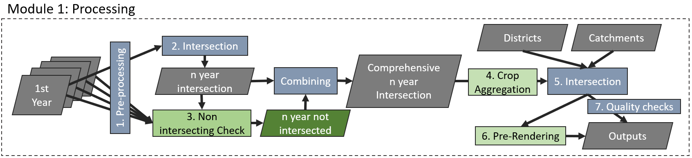
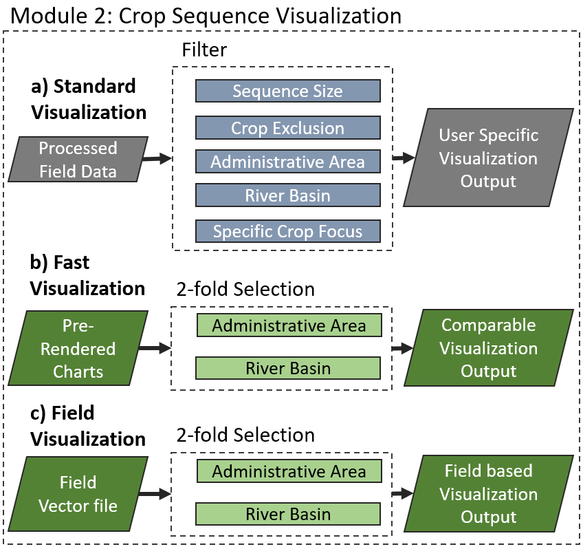

<div align="right">
  
</div>

# CropRotationViz  🌾 :corn:

<!-- badges: start -->
[](https://codecov.io/gh/franz-geoeco/CropRotationViz)
[](https://opensource.org/licenses/MIT)
<!-- badges: end -->

## Overview

CropRotationViz is a comprehensive R package that provides interactive Shiny applications for analyzing and visualizing crop rotation patterns from multi-year agricultural field data. The package integrates spatial data processing, statistical analysis, and dynamic visualization tools to help researchers and practitioners understand temporal patterns in agricultural land use.
The package consists of three main components:

- A processing application for preparing and intersecting field data with user customisable settings
- A full visualization application for detailed analysis
- A fast visualization application for quick insights and area comparison


<div align="center">
  
</div>


## Table of Contents
- [Overview](#overview)
- [Features](#features)
  - [Field Data Processing Tool](#field-data-processing-tool)
  - [Visualization Tools](#visualization-tools)
  - [Data Analysis](#data-analysis)
- [Installation](#installation)
- [Usage](#usage)
  - [Basic Usage](#basic-usage)
  - [Step-by-Step Guide](#step-by-step-guide)
    - [Processing](#processing)
    - [Visualization](#visualization)
- [Data Requirements](#data-requirements)
  - [Input Data Structure](#input-data-structure)
- [Example Data](#example-data)
- [Dependencies](#dependencies)
- [Background](#background)
  - [How it Works](#how-it-works)
  - [Example](#example)
- [Contributing](#contributing)
- [License](#license)
- [Citation](#citation)
- [Contact](#contact)
- [Acknowledgments](#acknowledgments)

## Features

- **Field Data Processing Tool**
  - Support for multiple spatial file formats (SHP, GeoJSON, FlatGeobuf, GeoPackage, SQLite)
  - Automated field intersection analysis
  - Spatial data validation and cleaning
  - Batch processing of multiple years of data

- **Visualization Tools**
  - Interactive map interface with field boundaries
  - Crop rotation sequence visualization
  - Custom color schemes for different crop types
  - Sankey diagrams for rotation flows

- **Data Analysis**
  - Crop sequence pattern analysis
  - Area calculations and statistics
  - Temporal change analysis
  - Support for different coding systems (NC codes and crop names)

## Installation

You can install the development version of CropRotationViz from GitHub:

```r
# Install devtools if you haven't already
install.packages("remotes")

# Install CropRotationViz
remotes::install_github("franz-geoeco/CropRotationViz")
```

## Usage

### Basic Usage

```r
# Load the package
library(CropRotationViz)

# Launch the Shiny processing application
run_processing_app()

# Launch the Shiny visualization application
run_visualization_app()

# Launch the Shiny fast visualization application
run_fast_visualization_app()
```

### Step-by-Step Guide
#### Generate Dummy Data
If you do not have field data at hand or just want to test the functionality of the application, you can run the following line, to produce dummy annual field shapefiles, which you can load into the processing application.

`CropRotationViz::dummy_filed_generator(output_dir = "path/to/your/dir")`

#### Processing
1. **Launch the Processing Application**
   - Run `CropRotationViz::run_processing_app()`
   - or add already an output_dir like `CropRotationViz::run_processing_app(output_dir = "path/to/dir")`
   - if all polygon files share a common column explaining the crops use `common_column = "your_column"`
   - if you don't want to input the years mannually add a start year `start_year = 2000`
   - if you don't need a preview of your intersection as Sankey chart (.png) set `preview = F`
   - if you don't need a vector file of your intersected fields set `vector_file = F`
   - The application will open your default web browser

2. **Load Data**
   - Click "Choose File" for each year of data
   - Select the appropriate spatial file (SHP, GeoJSON, FlatGeobuf, GeoPackage, or SQLite)
   - Choose the column containing crop codes or names
   - Assign the correct year to each file
3. **Select Settings**
   - Select processing options:
     - NC codes or crop names and years (if you didn't provide it)
     - Complete or fast intersection
     - Select if you want to enable a fast visualization mode (run_fast_visualization())
   - Customize the crop class aggregation (optional)

3. **Process Data**
   - Choose output directory (if you didn't provide it in the start function) and format
   - Click "Process Files" to start analysis

#### Visualization
1. **Launch the Visualization Application**
   - Run `CropRotationViz::run_visualization_app()`
   - or add alrady the input_dir with the output from the processing application like `CropRotationViz::run_visualization_app(input_dir = "path/to/dir")`
   - the application will open your default web browser

2. **Load Data**
   - Click "Browser" or drag and drop the .RData File from the processing output
     
3. **View Results**
   - Examine the interactive charts
   - Review processed data statistics

#### Fast Visualization
1. **Launch the Visualization Application**
   - Run `CropRotationViz::run_fast_vizualisation_app()`
   - or add alrady the input_dir with the output from the processing application like `CropRotationViz::run_fast_vizualisation_app(input_dir = "path/to/dir")`
   - the application will open your default web browser

2. **Load Data**
   - Click "Browser" or drag and drop the .RData File from the processing output
     
3. **View Results**
   - Examine the interactive map
   - Review processed data statistics

#### Field Visualization
1. **Launch the Field Visualization Application**
   - Run `CropRotationViz::run_field_level_app()`
   - the application will open your default web browser

2. **Load Data**
   - Click "Browser" or drag and drop the .shp/.fgb/.gpkg File from the processing output
     
3. **View Results**
   - wait for file loading
   - select region of interest
   - click on fields of interest
     
## Data Requirements

- Spatial files containing field boundaries
- Crop type information (NC codes or crop names)
- Minimum of 2 years of data
- Valid geometries
- Supported formats: SHP, GeoJSON, FlatGeobuf, GeoPackage, SQLite


### Input Data Structure
Your input data should contain at minimum the following attributes for each field:

| YEAR | CROP_CODE | CROP_NAME  | geometry |
|------|-----------|-----------|----------|
| 2020 | 110 | Wheat | POLYGON |
| 2020 | 200 | Corn | POLYGON |
| 2020 | 500 | Soybean | POLYGON |
| 2020 | 110 | Wheat | POLYGON |

Where:
- YEAR: The crop year
- CROP_CODE: Numerical code for the crop type (e.g., NC codes)
- CROP_NAME: Text name of the crop
- geometry: Spatial geometry of the field (POLYGON or MULTIPOLYGON)


## Test Data

The package includes a function for creating random test data:

```r
# create 100 test polygons from 2020-2023
CropRotationViz::dummy_field_creator(
  output_dir = "path/to/output",
  field_count = 100,
  years = 2020:2023
)
```

## Dependencies

CropRotationViz requires several R packages for spatial data processing and visualization. Key dependencies include:

- [shiny](https://github.com/rstudio/shiny) - Web application framework for R
- [shinythemes](https://github.com/rstudio/shinythemes) - Themes for Shiny
- [tidyverse](https://github.com/tidyverse/tidyverse) - Collection of R packages for data science
- [leaflet](https://github.com/rstudio/leaflet) - Create interactive web maps
- [ggalluvial](https://github.com/corybrunson/ggalluvial) - Alluvial diagrams in ggplot2
- [lattice](https://github.com/cran/lattice) - Data visualization system
- [colorspace](https://github.com/cran/colorspace) - Color space manipulations
- [shinyWidgets](https://github.com/dreamRs/shinyWidgets) - Custom widgets for Shiny
- [plotly](https://github.com/plotly/plotly.R) - Interactive web-based graphs
- [shinyBS](https://github.com/ebailey78/shinyBS) - Bootstrap components for Shiny
- [bslib](https://github.com/rstudio/bslib) - Custom Bootstrap themes for Shiny
- [DT](https://github.com/rstudio/DT) - R Interface to the DataTables library
- [sf](https://github.com/r-spatial/sf) - Simple Features for R
- [leaflet.minicharts](https://github.com/rte-antares-rpackage/leaflet.minicharts) - Add small charts on leaflet maps
- [shinycssloaders](https://github.com/daattali/shinycssloaders) - Add loading animations to Shiny outputs
- [shinyalert](https://github.com/daattali/shinyalert) - Easily create pretty popup messages in Shiny
- and others (see DESCRIPTION file)

All dependencies will be automatically installed when installing CropRotationViz.

## Background
The core functionality of the processing module centers around field intersection across multiple years of data. The system supports two intersection modes to accommodate different use cases:

Complete Intersection (Default): Includes all fields that appear in at least one year, with NA values populated for years where a field is absent
Fast Intersection: Only includes fields that are consistently present across all years

### How It Works
- **Complete Intersection Mode**
  - Identifies all unique fields across all available years Maintains fields even if they only appear in a subset of years Automatically fills missing data with NA values Preserves data completeness at the cost of additional processing time

- **Fast Intersection Mode**
  - Only retains fields that appear consistently across all years Reduces processing overhead Results in a smaller, more consistent dataset Activated by setting `intersection_type = "Fast"`

### Description
#### Processing interface structure:
<div align="center">
  
</div>

#### Intesection description example with a dataset spanning two years with varying fields:
<div align="center">
  
</div>

#### Visualization Interface structure:
<div align="center">
  
</div>


## User Manual
To get a more detailed description about the specific functionalities, look into the detailed [user manual](/docs/User_Manual.pdf).


## Contributing

Contributions are welcome! Please feel free to submit a Pull Request. For major changes, please open an issue first to discuss what you would like to change.

To contribute:

1. Fork the repository
2. Create your feature branch (`git checkout -b feature/AmazingFeature`)
3. Commit your changes (`git commit -m 'Add some AmazingFeature'`)
4. Push to the branch (`git push origin feature/AmazingFeature`)
5. Open a Pull Request

## License

This project is licensed under the MIT License - see the LICENSE file for details.

## Citation

If you use CropRotationViz in your research, please cite it:

```bibtex
@software{CropRotationViz2024,
  author = {Schulze, Franz},
  title = {CropRotationViz: Interactive Tool for Crop Rotation Sequence Analysis},
  year = {2024},
  publisher = {GitHub},
  journal = {GitHub repository},
  url = {https://github.com/franz-geoeco/CropRotationViz}
}
```

## Contact

Franz Schulze - franz.schulze@geo.uni-halle.de

Project Link: [https://github.com/franz-geoeco/CropRotationViz](https://github.com/franz-geoeco/CropRotationViz)

## Acknowledgments

- Martin Luther University Halle-Wittenberg
- Contributors and users who have provided valuable feedback
